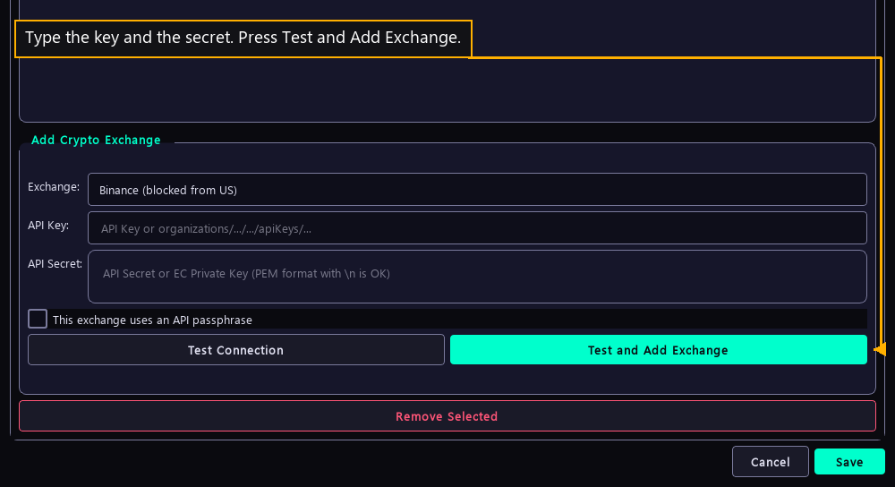

# Step 3 — Enter the venue keys

One step of the [New User Procedure](README.md) how-to.

**Type the key and the secret. Press Test and Add Exchange.**

The check runs first, and a failed check stores nothing. A stored venue gets its
own sub-tab under Live, carrying the New Bot button.
