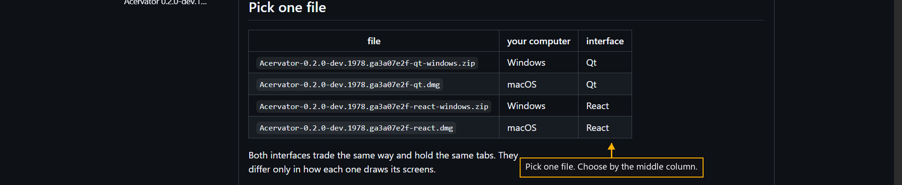

# Step 3 — Pick one file

One step of the [New User Procedure](README.md) how-to.

**Take the one file whose middle column names your computer.**

Four files are offered, Windows or macOS against Qt or React. Both interfaces
hold the same tabs and trade the same way.
