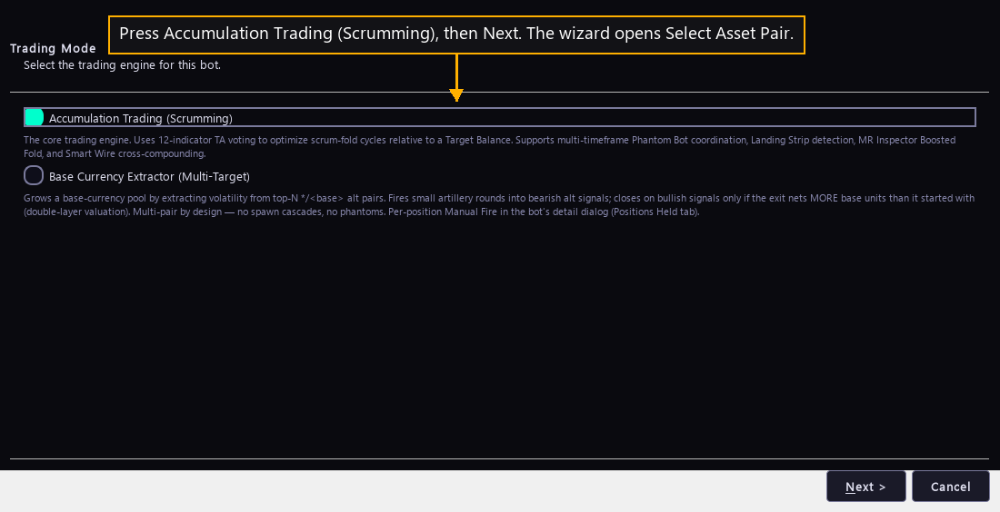

# Step 4 — Choose the engine

One step of the [New User Procedure](README.md) how-to.

**Press Accumulation Trading (Scrumming), then Next.**

The New Bot button opens this wizard on Trading Mode. Next opens Select Asset
Pair.
