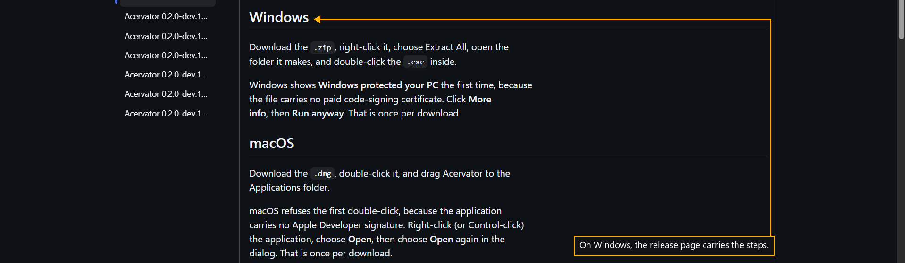

# Step 4 — On Windows

One step of the [New User Procedure](README.md) how-to.

**Right-click the file, choose Extract All, open the folder it makes, and
double-click the program inside.**

Windows says Windows protected your PC the first time, because the file carries
no paid code-signing certificate. Click More info, then Run anyway.
