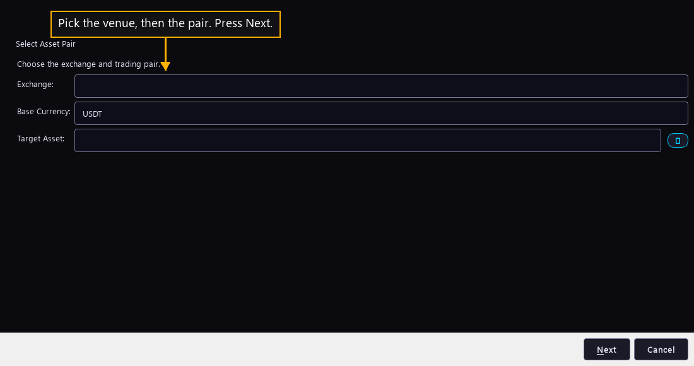

# Step 5 — Name what it trades

One step of the [New User Procedure](README.md) how-to.

**Pick the venue, then the pair. Press Next.**

This page names the one pair the bot trades. Base Currency opens on the value a
fresh install ships.
