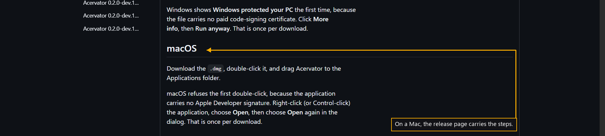

# Step 5 — On a Mac

One step of the [New User Procedure](README.md) how-to.

**Double-click the file, then drag Acervator to the Applications folder.**

macOS refuses the first double-click, because the application carries no Apple
Developer signature. Right-click the application, choose Open, then choose Open
again in the dialog.
