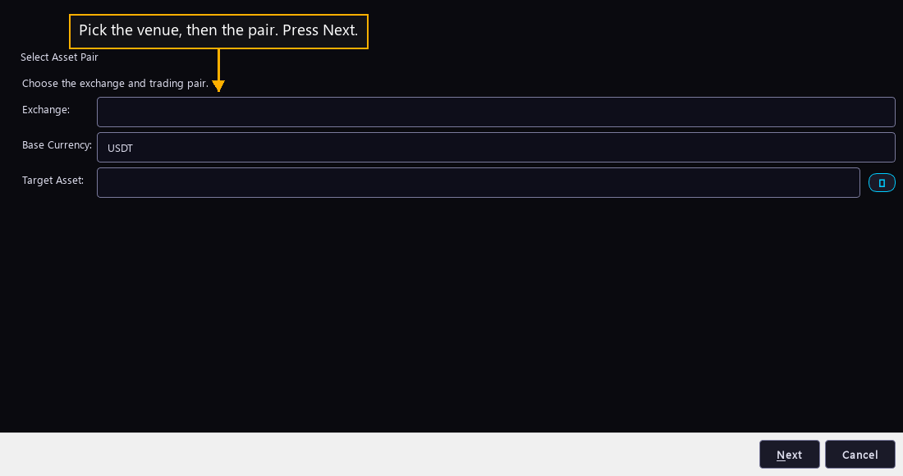

# Step 10 — Name what it trades

One step of the [New User Procedure](README.md) how-to.

**Pick the venue, then the pair. Press Next.**

This page names the one pair the bot trades. Base Currency opens on the value a
fresh install ships.

Three lists sit on the page. The first is the venue, the exchange this bot sends
its orders to. The second is Base Currency, the money the bot counts in. The
third is the asset the bot accumulates. The program joins the last two into one
pair, written asset over currency, and that pair is the only market this bot ever
touches.

The venue reaches further than this page. It decides which chart sizes the next
step can offer, because the list there is cut down to what the venue serves. It
also decides the smallest order the bot may place, which matters when a small
Target Balance is split across several price levels.

One bot, one pair. A second asset needs a second bot. The fleet page two steps on
is how a reader gets there without filling this wizard in again.

The live fleet runs 38 bots on 38 different pairs, no two the same, across one
venue and two base currencies. Picking the most heavily traded pair a reader
already understands is a sound first choice, because a thin market gives the bot
few chances to complete a round.
