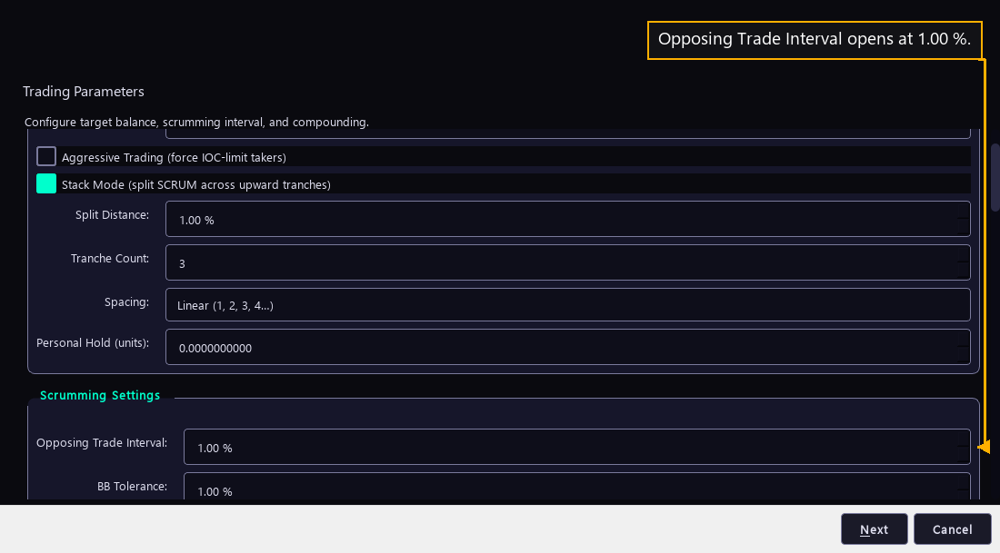

# Step 11 — How far price must move

One step of the [New User Procedure](README.md) how-to.

**Opposing Trade Interval sets the gap between one trade and the opposite one.**

This is the smallest move price has to make before the bot takes the opposite
trade. The manual states it as the minimum travel distance from one trade before
the next trade of the opposite type can occur. A fresh install opens it at
1.00 %, and the next five steps stay on this same page.

Scrumming Settings is the second of the seven groups this page shows. The four
steps after this one cover the rest of that group, and a fifth covers Hedge
Rebalance further down. The other groups open on their own settings and need no
change to create a first bot.

The box accepts 0.10 % up to 20.00 %. The figure is not the gap on its own. The
program adds Trading Fee %, four steps on, and the sum is the distance a sale has
to fall before the bot buys back, or a buy has to rise before the bot sells. Both
numbers matter, and raising either one widens the same gap.

A small figure costs money. The bot trades often, each round earns little, and
the venue takes its fee twice on every round. A large figure costs chances. The
bot waits for a move that may not arrive, and sits through swings it could have
harvested. There is no safe extreme: one bleeds to fees, the other does nothing.

The live fleet runs 5.00 %, the same figure on all 38 bots, after four and a half
months of trading. The field opens at 1.00 %, so a reader starting now sees
1.00 % on screen and the fleet runs five times that. A figure near 5.00 % is the
better place to start.
