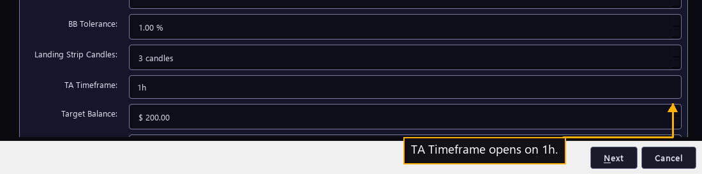

# Step 12 — What it watches

One step of the [New User Procedure](README.md) how-to.

**TA Timeframe picks the candle size every indicator reads.**

TA Timeframe is the price chart the bot watches to decide a trade. The manual
calls it the timeframe at which the bot operates. The list offered here is cut
down to the granularities the venue picked on the last page supports.

The two rows above it set how that chart is read. BB Tolerance opens at 1.00 %
and sets how close to a Bollinger Band price has to come before a trade can
happen. Landing Strip Candles opens at 3 and sets how many tight candles in a
row confirm a Landing Strip. The manual states three as the minimum, and says a
longer strip has historically been the stronger signal.

The full list runs from one minute to one day. Each tick the bot pulls the last
hundred candles of whichever size is picked here and builds every indicator on
them. The choice therefore sets how fast the bot sees a move. A one-minute chart
reacts within minutes and reports a great deal of noise as signal. A daily chart
is calm and may take a week to notice a swing the bot could have traded.

This row also reaches the shadow bots on the last page of the wizard. A shadow
bot must read a slower chart than this one, so a slow choice here leaves fewer
slower charts above it to choose from.

The live fleet runs a five-minute chart, the same on all 38 bots. The field opens
on one hour. A reader starting now sees one hour on screen, and the fleet runs
twelve times finer than that. Five minutes is the better place to start, and it
is fast enough to complete several rounds a day in a market that moves.

BB Tolerance accepts 0.25 % to 5.00 %, and the fleet runs the opening 1.00 % on
all 38. Landing Strip Candles accepts 2 to 10, and the fleet runs the opening 3
on all 38. Neither row has moved in four and a half months of trading, which is
the strongest case there is for starting where they open.

A tolerance that is too wide fires trades well away from a band, where the edge
is thinner. A strip requirement that is too long waits for a pattern the market
rarely draws, and the bot trades less often than it could.
