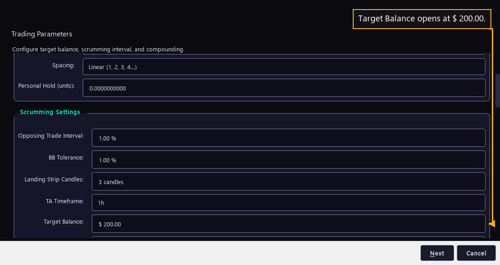

# Step 13 — Set the Target Balance

One step of the [New User Procedure](README.md) how-to.

**Set Target Balance.**

Target Balance is the balance this bot trades against. A fresh install opens it
at $ 200.00. The manual calls it the intended starting and locked value for the
position the bot controls.

This is the one figure in the group worth setting before a first bot runs. Three
more steps stay on this page after it.
