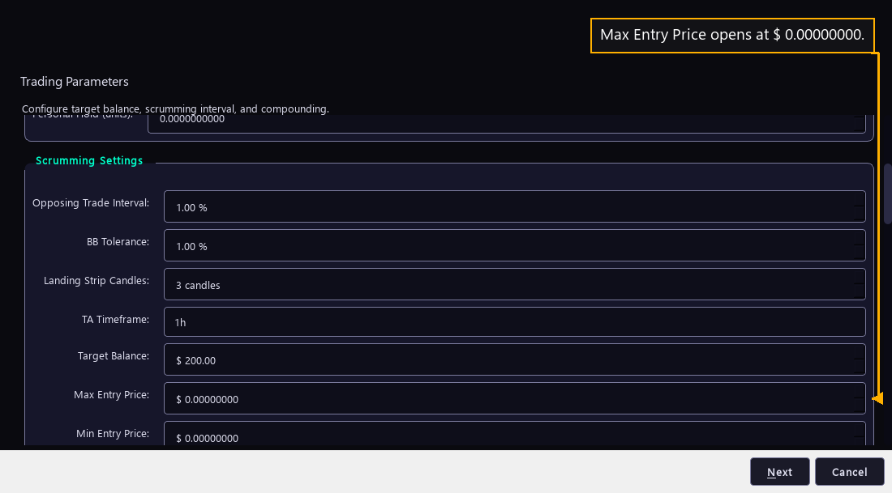

# Step 14 — The price window

One step of the [New User Procedure](README.md) how-to.

**Max Entry Price and Min Entry Price fence the price an automatic buy may pay.**

These two rows put a ceiling and a floor on the price at which the bot may open
its position. Zero means no limit, which is how a fresh install opens both.

The manual gives each one a job. Max Entry Price is the price at which the bot
will attempt its opening buy when it does not already hold enough of the asset.
Min Entry Price is the price at which it will attempt its opening sale when it
does. Only the buy side reads either number, so neither one can stop a sale.

Each box accepts zero up to ten million dollars, to eight decimal places, which
is enough precision for an asset priced in fractions of a cent. Zero is read as
no fence at all, not as a fence at zero.

Both fences bind the bot's own trades only. Manual Fire, the button on the bot's
detail screen that trades on command, passes through both of them.

A fence set wrong is the one setting on this page that can stop a bot dead. Put
the ceiling below where the market trades and every automatic buy is refused. The
bot keeps running, places nothing, and writes a line to the Console each time
saying which fence refused the buy and what the price was. That line is the way to
find this mistake, so a bot that never opens a position is worth checking here
first.

Not one of the 38 live bots carries either fence. All 38 run with no ceiling and
no floor, and have done through four and a half months of trading. The reason is
that the bot's own indicators already pick the moment to buy, and a fixed price
fence overrides that judgement with a guess made weeks earlier. A fence earns its
place when a reader has a hard limit of their own, such as a price they are not
willing to pay for an asset whatever the signal says.
