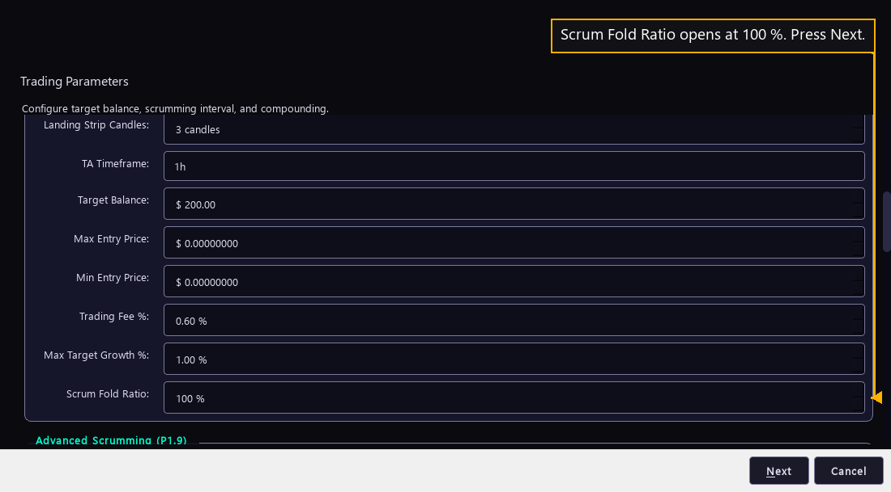

# Step 15 — What a cycle keeps

One step of the [New User Procedure](README.md) how-to.

**Leave the last three rows as they open, then press Next.**

Scrum Fold Ratio opens at 100 % and sets how much of a sale's profit is queued
to buy back in. The manual calls it the share redistributed to the bot's own
organic compounding.

Max Target Growth % opens at 1.00 % and caps how far Target Balance may grow in
one market cycle. The manual names it the organic compounding mechanic.

Trading Fee % opens at 0.60 % and holds the venue's fee per side. The manual
says it is added to the minimum opposing trade distance, so a bot does not lose
its gains to fees in a tight market.

Next leaves Trading Parameters and opens Phantom Bots.
