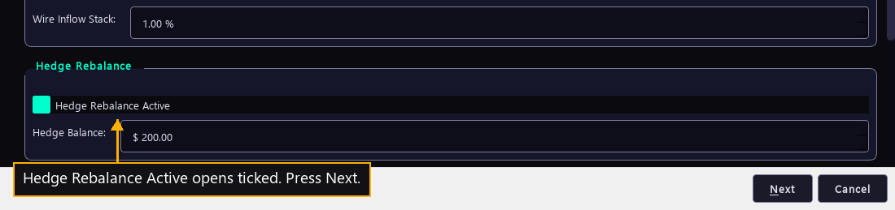

# Step 16 — The reserve for a dip

One step of the [New User Procedure](README.md) how-to.

**Hedge Rebalance Active decides whether the dip reserve may be spent.**

Hedge Rebalance is a group further down the same page, below Advanced Scrumming.
It holds money the bot keeps apart from Target Balance.

The tick decides whether the bot may use that money. The manual says it
determines whether price drifting below the first entry price can draw on a
limited amount of funds at bearish thresholds. Put plainly: when price falls, a
ticked box lets the bot buy from this reserve instead of from the balance it is
accumulating against.

Hedge Balance is the size of the reserve. A fresh install opens it at $ 200.00.
The manual calls it the limit on the extra money one bot is allowed to absorb
when price drifts below its first entry price. One such buy spends half of what
the reserve holds at that moment.

A reserve of zero is not an off switch. The manual is explicit about it: zero is
an empty reserve that never refills, and whatever the bot already holds stays
spendable until it drains. Clearing the tick is what turns the hedge off.

With the box clear, the reserve ceiling reads zero whatever Hedge Balance says, so
the reserve can fund nothing. With the box ticked, the ceiling is the Hedge
Balance figure, and the reserve refills itself slowly out of the bot's own
compound growth, taking eight cents in every dollar of growth until it reaches the
ceiling again.

This is money beyond Target Balance. It is the one setting in the wizard that
lets a bot spend more than the line the reader drew on the step before. That is
its whole point and also its whole risk: it buys deeper into a fall, which pays
well if the fall ends and costs more if it does not.

The live fleet runs it off on 32 of its 38 bots and on for 6. The box opens
ticked, so a reader starting now sees it ticked and the fleet mostly runs it
clear. Thirty-six of the 38 hold a reserve of zero; the other two hold the figure
a fresh install ships. Starting with the box clear keeps a first bot inside one
number the reader chose, which is the easier thing to judge after a week of
trading.

Next leaves Trading Parameters and opens Phantom Bots.
