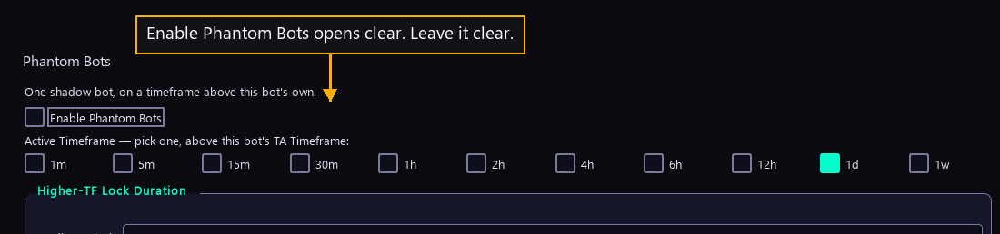

# Step 17 — The shadow bot

One step of the [New User Procedure](README.md) how-to.

**Enable Phantom Bots adds a slower reader above this bot.**

A phantom is a shadow bot reading a timeframe above this bot's own. One bot
needs none, and the box opens clear.

A phantom places no orders and holds no money. It reads a slower chart and reports
one thing: whether that slower chart looks like it is rising or falling. The main
bot then uses that report as a veto. It will not sell while the slower chart is
rising, and it will not buy while the slower chart is falling. Both of those vetoes
are switched on for every live bot, so a phantom, once enabled, really does hold
trades back.

The row of timeframe boxes under the tick is where a reader picks which slower
chart the phantom reads. Only a chart slower than the one chosen two steps back
can be picked; the program refuses the rest and says why. The lock duration in the
step after this one belongs to the same mechanism.

The cost of enabling one is a second chart fetched from the venue on every tick,
and a veto that can hold a good trade back when the slower chart is slow to turn.
The gain is fewer trades taken against the larger trend.

All 38 live bots run with phantoms off, through four and a half months of trading.
The box opens clear, so a reader starting now matches the fleet by changing
nothing here. Every one of the 38 still carries fifteen minutes as its stored
phantom chart, ready for the day it is switched on. A first bot is easier to judge
without one, because every refusal in the Console then belongs to the bot itself.
