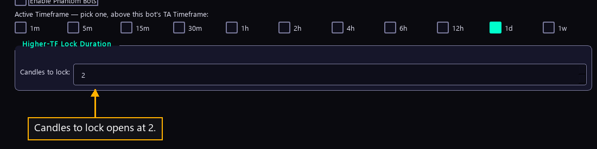

# Step 18 — How long a lock holds

One step of the [New User Procedure](README.md) how-to.

**Candles to lock sets how long a slower chart holds a trade back.**

Higher-TF Lock Duration is the one group on this page. It sits under the
timeframe row, below the box the step before covers.

A lock is a hold placed by a slower chart. The manual says this figure sets how
many candles such a lock keeps an opposing trade back for. The box runs from 1
to 10 and opens at 2. It stays usable whether or not phantom bots are enabled,
so a newcomer reaches it on the way to Finish.

**Nothing in the program creates a lock yet.** The manual says so: nothing calls
the step that adds one, so the countdown never starts and the lock test answers
no on every pass.

The manual also records that a new bot never receives this figure. Its own
counter opens at 2 by itself, and only the Bot Settings screen writes the figure
onto a bot that is already running. Leaving the box alone changes nothing a
first bot does.

The figure is counted in candles of the slower chart, not of the bot's own. Two
candles of a fifteen-minute chart is half an hour. The same two candles on a daily
chart is two days. So the number means very different lengths of time depending on
which chart the step before picked, and a reader checking the duration should read
the two rows together.

What it would do, once something creates a lock, is refuse the opposite trade for
that many candles after the slower chart turns. A long duration would make the bot
patient and cost it trades. A short one would let it trade against the slower chart
almost at once. Neither can be observed today, because nothing starts a countdown.

All 38 live bots hold 2, which is the figure the box opens at and also the figure a
new bot gives itself. Nothing on this row needs attention to create a first bot,
and nothing on it can be tested until the lock mechanism is wired up.
