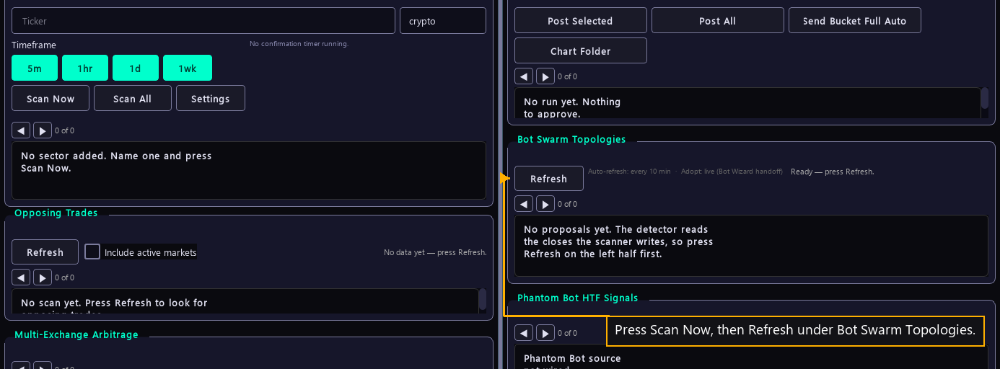

# Step 20 — Make the fleet

One step of the [New User Procedure](README.md) how-to.

**Open Inspector and scan. Press Preview on a topology proposal, then Adopt.**

The picture is the Inspector before the scan, so it lists no proposal yet. Scan
Now sits on the left half and Bot Swarm Topologies on the right. Each proposal
the pane lists carries Preview, and Preview carries Adopt. Adopt is the only
control on that screen that creates anything. It opens the wizard once for each
new bot.
