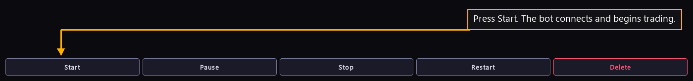

# Step 21 — Start the fleet

One step of the [New User Procedure](README.md) how-to.

**Start each bot from the bot list under Live.**

The command row runs along the bottom of the venue page, under the bot list.
The page hides the list until a bot exists, so the picture carries the row
alone. Start acts on the bot the list has selected. The fleet is running.
