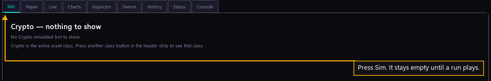

# Step 22 — The Simulator

One step of the [New User Procedure](README.md) how-to.

**Press Sim.**

Sim replays your fleet against stored price history. No venue is called and no
money moves, so a setting you are unsure of can be tried here first. The tab is
empty until a run plays.
