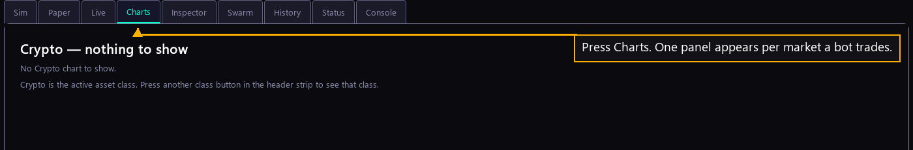

# Step 24 — The chart

One step of the [New User Procedure](README.md) how-to.

**Press Charts.**

Charts draws one candlestick panel for every market a bot of yours trades. It is
where you watch the price your bot is working against. The tab is empty until a
bot runs.
