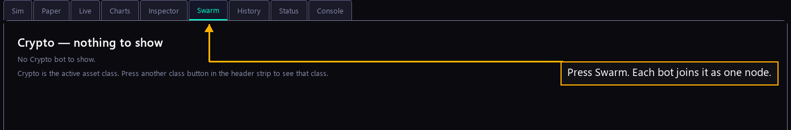

# Step 26 — The swarm

One step of the [New User Procedure](README.md) how-to.

**Press Swarm.**

Swarm draws your fleet as nodes, with a wire wherever one bot sends profit to
another. It is how you see the fleet as one thing rather than a list. The tab is
empty until a bot runs.
