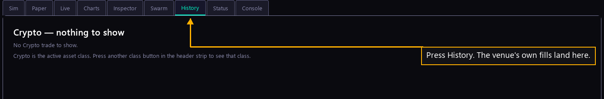

# Step 27 — What it has traded

One step of the [New User Procedure](README.md) how-to.

**Press History.**

History asks each venue for your own fills and grades them against what the
platform read at the time. It is the record to check when you want to know what
a bot actually did. The tab is empty until a bot has traded.
